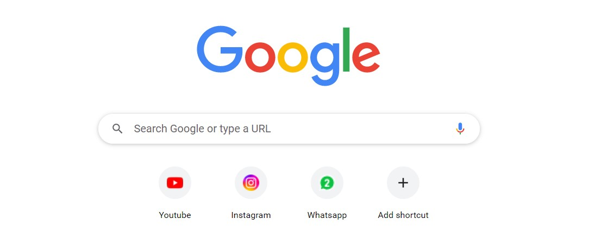
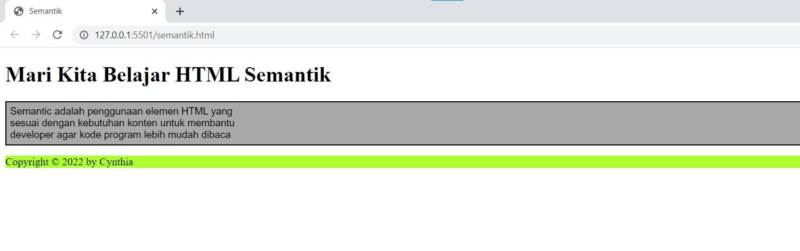
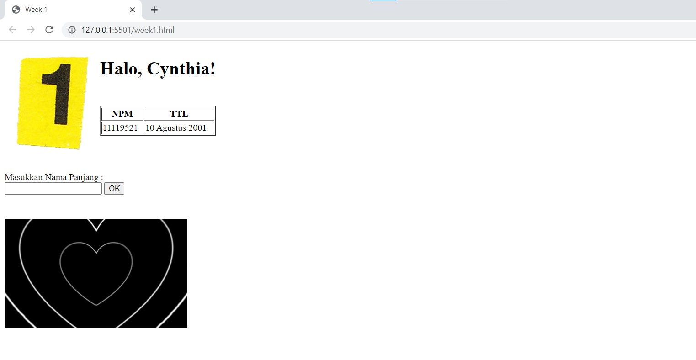
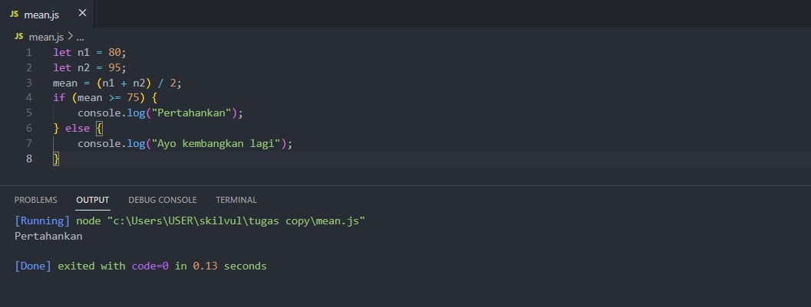

# Writing and Presentation Test Week 1
## **Unix Command Line**
### **Shell**
- Shell merupakan sebuah antarmuka berfungsi sebagai perantara yang memungkinkan pengguna untuk berinteraksi dengan sistem operasi pada komputer 
- Shell digunakan untuk memproses perintah yang diketik di CLI
- Jadi apakah itu CLI?

### **CLI (Command Line Interface)**
- Secara singkat, CLI adalah Shell yang berbasis teks
- CLI merupakan *tools* untuk pengguna agar mereka dapat memberikan perintah langsung kepada komputer dalam bentuk teks
- Salah satu bahasa pemrograman untuk menggunakan dan menjalankan CLI adalah Bash

### **Mengakses CLI**
- Pada tugas ini saya akan mengakses CLI dengan menggunakan Bash (Bourne Again Shell)
- Bash adalah aplikasi terminal populer di Linux
- Untuk memanfaatkan utilitas umum Bash pada Windows dengan mudah dapat digunakan Git Bash
- *Install* Git terlebih dahulu lalu setelah itu buka Git Bash yang sudah ter-*install* dalam komputer

### **File System Structure**
- File System Structure mengatur struktur bagaimana sebuah data disimpan di dalam sebuah sistem
- Struktur yang digunakan untuk sistem operasi Windows mempunyai bentuk menyerupai pohon dengan direktori atau folder utama berperan sebagai akar dari pohon tersebut

### **Command-Command dasar CLI**

Terdapat beberapa command yang biasa digunakan, antara lain yaitu :

> - **pwd** digunakan untuk melihat *current working directory*


> - **cd** digunakan untuk berpindah direktori


> - **ls** digunakan untuk melihat isi sebuah direktori


> - **head** dan **tail** digunakan untuk melihat beberapa line awal dari sebuah file teks
> - **cat** digunakan untuk melihat isi sebuah file


> - **mkdir** digunakan untuk membuat sebuah direktori


> - **touch** digunakan untuk membuat sebuah file


> - **cp** digunakan untuk menyalin file dan direktori


> - **mv** digunakan untuk memindahkan atau me-*rename* file dan direktori


> - **rm** digunakan untuk menghapus file dan direktori


## **Git & GitHub Dasar**

- Git dan GitHub keduanya merupakan *tools* yang wajib digunakan bagi para software developer untuk berkolaborasi dengan satu sama lain dalam mengerjakan suatu projek
- Dengan menggunakan *tools* seperti Git dan GitHub, software developer dapat mengelola kode projek bersama meski berbeda tempat
- Tidak perlu menunggu rekan dalam satu tim untuk menyelesaikan suatu program dahulu

### **Perbedaan Git & GitHub**

- Git
  - Sebagai *version control system*, gunanya adalah untuk merangkum atau mencatat perubahan kode sumber secara individu atau tim
  - Perlu di-*install* secara lokal terlebih dahulu, dapat digunakan secara offline

- GitHub
  - Digunakan untuk menyimpan dan mengelola kode suatu projek secara terpusat
  - Layanan berbasis web, diakses secara online

### **Setup Git & GitHub**

- Buat akun GitHub terlebih dahulu jika belum punya
- Lakukan setup awal dengan git config (E-mail yang disetup harus sama dengan yang di GitHub)

``` 
    git config --global user.name "Username"
    git config --global user.email "Contoh_Email@gmail.com"
```


- Cek instalasi dengan git version

``` 
    git --version
```


- Cek setup

``` 
    git config --list
```


### **Membuat Git Repository**

-  Repository adalah direktori atau folder dari projek yang dibuat, untuk membuat sebuah repository dapat menggunakan perintah git dibawah ini :

``` 
    git init nama_repository
```

> Note: Jika direktori sudah ada maka lakukan ini di dalam direktori :

``` 
    git init .
```


### **Kondisi File pada Git**

Terdapat 3 kondisi file di Git ketika mengalami perubahan, yaitu :

> - **Modified** adalah kondisi file ketika perubahan sudah dilakukan, tetapi belum ditandai (untracked) dan belum disimpan dalam version control.
> - **Staged** adalah kondisi dimana perubahan sudah ditandai namun belum disimpan di version control.
> - **Committed** adalah kondisi dimana perubahan sudah disimpan pada version control.

Bagaimana sebuah file mengalami kondisi-kondisi diatas? Berikut adalah tahapan yang dilakukan secara tersusun untuk menyimpan perubahan dalam repository git

- Lakukan perubahan di dalam repository terlebih dahulu, contoh: membuat file baru


- Cek status repository untuk melihat perubahan yang belum ditandai menggunakan :

``` 
    git status
```


- Jalani perintah git add untuk menandai perubahan ke kondisi *staging* secara temporer

``` 
    git add nama_file
```

> Note: Jika perubahan ada banyak gunakan :

``` 
    git add .
```


- Terakhir dilakukan commit untuk menyimpan perubahan pada version control dari kondisi *staging* secara permanen

``` 
    git commit -m "..."
```


> Note: Ketika dilakukan revisi kedua kalinya pada file, kondisi sebuah file bukan lagi *untracked* namun menjadi *modified*

### **Perintah Git Lainnya**

Masih banyak perintah yang dapat dilakukan dalam Git selain yang sudah diungkit diatas, beberapanya adalah :

> - **git log** digunakan untuk melihat catatan log dari perubahan-perubahan yang tersimpan
> - **git checkout** digunakan untuk menukar *branch* yang aktif dengan *branch* yang sudah dipilih, berfungsi seperti *checkpoint* dalam game
> - **git reset** digunakan untuk membatalkan perubahan yang dilakukan, perubahan yang di-*reset* tidak dapat dikembalikan
> - **git revert** berbeda dengan reset yang menghilangkan commit terakhir, git revert membatalkan semua perubahan yang ada tanpa menghapus commit terakhir
> - **git branch** wajib digunakan ketika sedang berkolaborasi dengan tim untuk menghindari konflik dalam mengembangkan kode, banyak developer tidak boleh berkolaborasi di dalam satu branch (fitur) yang sama
> - **git merge** digunakan untuk membuat *branch* yang bercabang menjadi satu kembali

Sudah mempelajari bagaimana mengelola repository secara lokal? Lalu bagaimana caranya memindahkan dari lokal ke remote repository di GitHub?

### **Meng-*upload* Projek ke GitHub**

- Jika sudah memiliki akun GitHub, buatlah sebuah repository terlebih dahulu
- Dalam repository lokal yang ingin di-*publish* lakukan git remote untuk membuat sebuah jembatan antara repository yang lokal dan di GitHub

``` 
    git remote add origin alamat_HTTPS
```


- Setelah jembatan terbuat, dilakukan git push untuk mengirimkan file/perubahan file ke dalam remote repository

``` 
    git push -u origin master
```


> Note: Jika perangkat belum terkoneksi, lakukan *device activation* terlebih dahulu

### **Cloning Repository GitHub ke Lokal**

Untuk sebaliknya, kita dapat melakukan cloning untuk menyimpan repository pada GitHub ke repository lokal

- Buka repository GitHub yang ingin di-*clone*
- Git bash repository lokal yang ingin digunakan untuk menyimpan repository GitHub
- Gunakan perintah git clone seperti dibawah ini :

``` 
    git clone alamat_HTTPS
```


## **HTML**

Apa itu HTML? HTML atau *Hypertext Markup Language* digunakan untuk pembuatan kerangka halaman website agar dapat menampilkan berbagai informasi baik tulisan maupun gambar pada sebuah *web browser*

Berikut adalah beberapa fungsi/peranan HTML dalam *web development* :

- Mengatur serta mendesain kerangka halaman *website*
- Mempublikasikan halaman *website* sehingga dapat diakses dan ditampilkan secara daring
- Membuat tabel dan forum pada halaman *website*
- Menampilkan gambar dan video pada halaman *website*

Ada 2 tools pendukung yang dibutuhkan untuk dapat menjalani HTML, yaitu :
1. Browser
2. Code Editor

Pada tugas ini browser dan *code editor* yang akan digunakan adalah Google Chrome dan Visual Studio Code




### **Membuat HTML Sederhana**

> Note: Untuk membuat HTML sederhana bisa tanpa menggunakan struktur, tapi lebih baik perlu diketahui terlebih dahulu struktur dari HTML

- HTML tersusun dengan tingkatan seperti pohon keluarga, sebuah elemen yang berada di dalam elemen lain disebut *child* dan elemen yang berada di luar elemen tersebut adalah *parent*-nya

Berikut adalah penulisan struktur HTML, di dalam tag body terdapat isi dari dokumen HTML yang akan ditampilkan pada web


Ketika dijalankan di browser dengan meng-*copy path*, akan terlihat seperti ini :


Contoh diatas merupakan cara menjalankan file HTML secara manual, hal tersebut memiliki sebuah kekurangan yaitu ketika terdapat perubahan dalam kode halaman harus terus di-*refresh* untuk melihat perubahan

> Note: Untuk menjalankan kode dengan mudah tanpa perlu refresh berulang kali, cukup menggunakan sebuah fitur dari Visual Studio Code bernama *Live Server*

### **Menggunakan Live Server**

- Pertama, *install* ekstensi *Live Server* ke dalam Visual Studio Code


- Lalu setelah ter-*install*, buka kode program HTML yang ingin dijalankan dan pilih opsi *Open with Live Server*


- Setiap kali perubahan disimpan pada kode program, tampilan pada browser akan otomatis ter-*update*


### **Tag HTML Populer**

Dalam menggunakan HTML kita tidak mungkin dapat menghafal seluruh tag yang ada karena banyak sekali, dan memang dalam belajar HTML kita tidak diharuskan untuk mengingat ada tag apa saja

Terus apa itu tag populer?

Sesuai dengan fungsi HTML yang sudah dibahas sebelumnya, HTML dapat digunakan untuk membuat tabel dan form serta menampilkan gambar dan video ke halaman web

> - **img** digunakan untuk menampilkan gambar dari file lokal komputer atau menggunakan link

``` 
    
```

> - **video** digunakan untuk menampilkan video dari file lokal komputer atau menggunakan link

``` 
    <video controls>
      <source src="..." type="...">
    </video>
```

> - **table** digunakan untuk membuat table

Ada beberapa tag dasar yang selalu digunakan dalam membuat table HTML, yaitu : tr untuk baris, th untuk header, dan td untuk isi tabel

``` 
    <table>
      <tr>
        <th></th>
      </tr>

      <tr>
        <td></td>
      </tr>
    </table>
```

> - **form** digunakan untuk membuat form

Jenis input elemen di dalam form bermacam-macam, ada yang bertipe teks, radio, check, dll

Yang mengindikasikan elemen tersebut merupakan bagian dari form adalah jika elemen ada di dalam tag :

``` 
    <form></form>
```


> Note: Diatas merupakan kode program dan hasil pengaplikasian tag HTML populer

### **Semantic HTML**

Semantic adalah penggunaan elemen HTML yang sesuai dengan kebutuhan konten untuk membantu developer agar kode program lebih mudah dibaca


> Note: Diatas merupakan kode program dan hasil pengaplikasian semantic HTML menggunakan header, article, dan footer

### **Deploy HTML**

Apa itu deployment HTML dan apa gunanya?

Deploy HTML adalah sebuah aksi penyebaran aplikasi HTML berbasis web yang sudah kita buat ke server agar dapat digunakan oleh orang lain

Untuk deploy HTML ada *tools* dengan nama Netlify, langkah untuk deploy projek anda adalah :

- Buka situs netlify.com dan buat akun jika belum punya menggunakan email atau GitHub
- Masuk ke *tab sites* dan upload folder projek


- Untuk melanjutkan ke tahap berikutnya dapat dilakukan dengan mengatur domain

## **CSS**

CSS atau *Cascading Style Sheet* adalah sesuatu yang digunakan untuk mendesain dan menata tampilan dokumen HTML

CSS dalam web development mempunyai peranan untuk :
- Mengubah tampilan HTML yang sederhana sehingga terlihat lebih menarik dan rapi
- Mengontrol tata letak dan ukuran elemen HTML pada web
- Mengelola tampilan dengan CSS efektif karena beban saat proses loading lebih kecil dibanding ketika mengatur tampilan menggunakan HTML

### **Menyisipkan CSS ke HTML**

Cara menyisipkan CSS ke HTML ada 3 berdasarkan penempatan kodenya :

> - **inline** adalah cara menuliskan kode CSS yang ditulisan langsung di dalam elemen HTML

``` 
    <h1 style="color:red;"></h1>
```

> - **internal** adalah menuliskan kode CSS di bagian head file HTML

``` 
    <head>
      <style>
        h1 {
          color:red;
        }
      </style>
    </head>
```

> - **external** adalah penulisan kode CSS di luar file HTML, agar HTML dapat menggunakan CSS external perlu ditambahkan sumber kode di head HTML 

``` 
    <head>
      <link rel="stylesheet" type="text/css" href="...">
    </head>
```

### **Struktur CSS**

Struktur CSS terdiri dari selector, property, dan value

``` 
    selector {
      property:value;
    }
```

> Note: Ada berbagai macam penulisan selector dalam CSS dilihat dari class, id, elemen, dll

### **Penerapan Styling CSS pada HTML**

Dibawah ini merupakan pengaplikasian CSS external sederhana pada halaman HTML yang sebelumnya sudah dibuat




### **Responsive Web Design**

- Responsive web design sebuah teknik atau metode untuk membuat layout dari halaman website dapat menyesuaikan diri sesuai dengan ukuran layar perangkat pengguna

- Media Query adalah salah satu fitur dalam CSS yang memungkinkan pengguna untuk menentukan kapan aturan CSS tertentu harus diterapkan


Pada kode CSS diatas padding dan margin yang dimiliki oleh elemen paragraph dapat berbeda antara layar yang lebarnya maksimal 320px dan 1920px


Layar memiliki lebar 1920px (monitor) oleh karena itu margin dan padding elemen paragraph masing-masing adalah 15px dan 20px

### **Flexbox**

- Merupakan konsep layout dalam CSS yang digunakan untuk mengatur elemen atau container beserta isinya
- Flexbox mampu beradaptasi dengan ukuran *container*-nya

Properti-properti dalam Flexbox adalah sebagai berikut :

> - **display** adalah langkah pertama untuk membuat sebuah container menjadi flex
> - **flex-direction** digunakan untuk menentukan arah isi container
> - **flex-wrap** memungkinan isi dari container berlanjut ke baris berikutnya
> - **justify-content** digunakan untuk mengontrol alignment dari isi container




> Note: Diatas merupakan penerapan konsep Flexbox pada konten dalam halaman web

## **Algorithm & Data Structures**

### **Algoritma**
- Merupakan sekumpulan instruksi atau langkah-langkah yang berurut dan digunakan untuk mencapai suatu tujuan
- Disusun secara logis dan sistematis
- Manfaat dilakukannya algoritma adalah untuk memungkinkan developer untuk berpikir analis dan kritis dalam menyelesaikan suatu masalah agar solusi lebih efektif
- Programming sendiri adalah pemecahan suatu masalah oleh karena itu algoritma sudah menjadi bagian penting dalam programming

### **Struktur Data**
- Adalah cara mengatur dan mengorganisir penyimpanan data sedemikian rupa agar operasi dapat dilakukan dengan lebih mudah
- Digunakan untuk mengolah data menjadi terstruktur dan efisien
- Struktur data dapat meningkatkan kualitas dari algoritma

### **Penyajian Algoritma**

Algoritma dapat disajikan dalam 3 bentuk, yaitu :

> 1. **Deskriptif** penulisan algoritma seperti tata cara dengan bahasa sehari-hari
> 2. **Flowchart** adalah penyajian algoritma menggunakan tampilan visual dengan simbol bangun datar
> 3. **Pseudo Code** adalah penulisan algoritma yang menyerupai penulisan kode program

> Note: Pseudo Code bukanlah bahasa pemrograman

### **Contoh Algoritma Sederhana**

Dibawah merupakan sebuah algoritma sederhana yang ditulis dengan penyajian Pseudo Code

``` 
    Rata-Rata Nilai Matematika & Inggris
    deklarasi
      n1 = nilai matematika
      n2 = nilai inggris
      mean = rata-rata nilai matematika & inggris
    kondisi
      jika mean >= 75 maka
        print "Pertahankan"
      tetapi jika mean < 75 maka
        print "Ayo kembangkan lagi"
```

### **Penerapan Algoritma**

Algoritma sederhana yang sudah dibuat dapat diaplikasikan ke dalam bentuk kode pemrograman

``` 
    let n1 = 80;
    let n2 = 95;
    mean = (n1 + n2)/2;
    if (mean >= 75) {
      console.log("Pertahankan");
    } else {
      console.log("Ayo kembangkan lagi");
    }
```



> Note: Diatas adalah penerapan algoritma ke JavaScript

## **JavaScript Dasar**

- Digunakan untuk membuat halaman web lebih dinamis dan interaktif
- JavaScript meningkatkan fungsionalitas web
- Yang membuat JavaScript berbeda dari yang lain adalah DOM (*Document Object Model*) yang memiliki fungsi-fungsi untuk memanipulasi konten

Ada berbagai macam cara untuk menjalankan JavaScript, dapat menggunakan *console browser*, *text editor* seperti Visual Studio Code, Node.js dll

> Note: Biasanya JavaScript dijalankan disisipkan ke dalam HTML yang bertindak sebagai kerangka web

### **Tipe Data JavaScript**

JavaScript mempunyai beberapa tipe data yang perlu diketahui, diantaranya adalah :
- Boolean

``` 
    let x = true;
    let y = false;
```

- Number

``` 
    let num = 10;
```

- String

``` 
    let pesan = "Hallo";
```

- Null

``` 
    let z = null;
```

- Undefined

``` 
    let z;
```

- Object

``` 
    let siswa = {
      nama: 'Cynthia';
      npm: '11119521';
    }
```

- Array

``` 
    let buah = ['Jeruk', 'Apel', Mangga'];
```

### **Operator JavaScript**

Operator-operator di JavaScript dibagi menjadi beberapa jenis, yaitu :

> - **Operator Aritmatika** biasanya digunakan untuk melakukan perhitungan matematika

``` 
    +     :  Penjumlahan
    -     :  Pengurangan
    *     :  Perkalian
    /     :  Pembagian
    %     :  Hasil bagi
    ++    :  Increment
    --    :  Decrement
```

Contoh penggunaan :

``` 
    let a = 1;
    let b = 2;
    let hasil = a + b;

    console.log(hasil); //3
```


> - **Operator Assignment** digunakan untuk memasukkan suatu nilai ke dalam variabel, dibawah ini adalah operator penugasan beserta contohnya

``` 
    =     :  x = y
    +=    :  x = x + y
    -=    :  x = x - y
    *=    :  x = x * y
    /=    :  x = x / y
    %=    :  x = x % y
```

> - **Operator Perbandingan** digunakan untuk membandingkan sebuah nilai atau variabel dengan variabel lainnya

``` 
    ==    :  Sama dengan
    ===   :  Sama value dan tipe
    !=    :  Tidak sama
    !==   :  Tidak sama value dan tipe
    >     :  Lebih dari
    <     :  Kurang dari
    >=    :  Lebih dari sama dengan
    <=    :  Kurang dari sama dengan
    ?     : Operator ternary (digunakan seperti kondisional)
```

Contoh penggunaan :

``` 
    let a = 1;
    let b = '1';
    banding1 = a == b;
    banding2 = a === b;

    console.log(banding1); //true
    console.log(banding2); //false
```


> - **Operator Logika** digunakan untuk membandingkan kondisi logika antara variable-variable atau value

``` 
    &&    :  AND
    ||    :  OR
    !     :  NOT
```

Prinsip operator logika :

``` 
    trua && true    : true
    true && false   : false
    false && false  : false
    true || true    : true
    true || false   : true
    false || false  : false
    !true           : false
    !false          : true
```

Contoh penggunaan :

``` 
    let a = 1;
    let b = '1';
    banding1 = a == b;
    banding2 = a === b;
    logika = banding1 && banding2;

    console.log(banding1); //true
    console.log(banding2); //false
    console.log(logika); //false
```


> Note: Saya hanya memasukkan jenis-jenis operator yang sering dipakai

### **JavaScript Control Flow**

- **Conditonal**
  - Merupakan statement percabangan, artinya statement conditional akan mengecek kondisi dan menjalankan perintah berdasarkan kondisi tersebut
  - Perintah yang dijalankan dipilih dari apabila kondisi logika bernilai true

- **Looping**
  - Adalah control flow yang mengulang sebuah instruksi hingga kondisi terpenuhi
  - Looping biasanya digunakan untuk mempersingkat penulisan kode dan menghemat waktu

Nah sudah kelihatan kan perbedaan antara conditional dan looping? Dibawah adalah beberapa control statement conditional dan looping dalam JavaScript yang tidak asing

### **Conditional**

> - **if** digunakan untuk menjalankan blok perintah dalam statement if apabila kondisi itu benar

``` 
    if (kondisi) {
      // kode blok
    }
```

> - **if ... else** adalah percabangan if yang memiliki 2 blok pilihan, dimana pada statement if diberikan sebuah kondisi namun jika tidak terpenuhi maka program akan menjalankan perintah dalam statement else

``` 
    if (kondisi) {
      // kode blok
    } else {
      // kode blok yang dijalankan kalau kondisi false
    }
```

> - **if ... elseif** merupakan percabangan if else yang di dalamnya terdapat pilihan kondisi alternatif lain selain dalam if, else if dituliskan setelah statement if dan bisa lebih dari satu

``` 
    if (kondisi) {
      // kode blok
    } else if (kondisi 2) {
      // kode blok
    } else {
      // kode blok
    }
```


> - **switch** adalah percabangan yang memilih sebuah case berdasarkan pencocokan dari nilai sebuah case dan statement kondisi

``` 
    switch (kondisi) {
     case ...:
          // kode blok
     break;
     case ...:
          // kode blok
     break;
     default:
          // kode blok
}
```

### **Looping**

> - **for** adalah looping yang biasanya digunakan untuk mengulangi kode jika sudah diketahui banyak perulangannya, di dalam for loop terdapat 3 ekspresi
>   - ekspresi 1 untuk inisialisasi nilai awal
>   - ekspresi 2 adalah kondisi looping berhenti
>   - ekspresi 3 adalah untuk increment/decrement

``` 
    for (ekspresi 1; ekspresi 2; ekspresi 3) {
      // kode blok
    }
```


> - **while** berbeda dengan for, while digunakan untuk perulangan yang memiliki syarat tetapi tidak tentu berapa banyak perulangannya

``` 
    while (kondisi) {
      // kode blok
    }
```

> - **do while** sama seperti while namun jika while melakukan pengecekan kondisi diawal statement, maka do while akan melakukan perintah di dalam blok terlebih dahulu baru melakukan pengecekan kondisi

``` 
    do {
      // kode blok
    } while (kondisi);
```