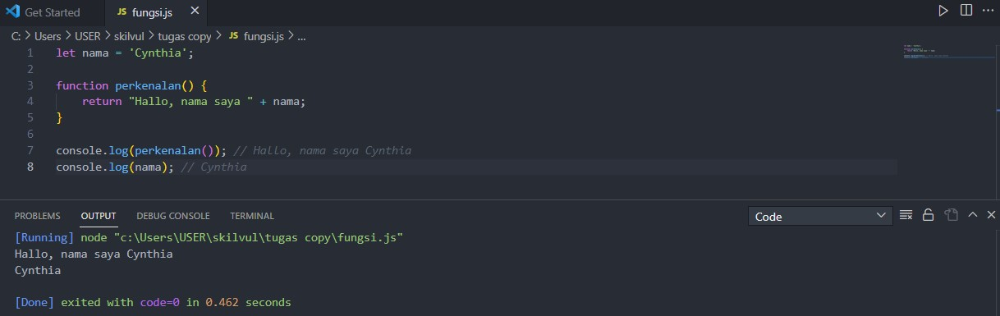
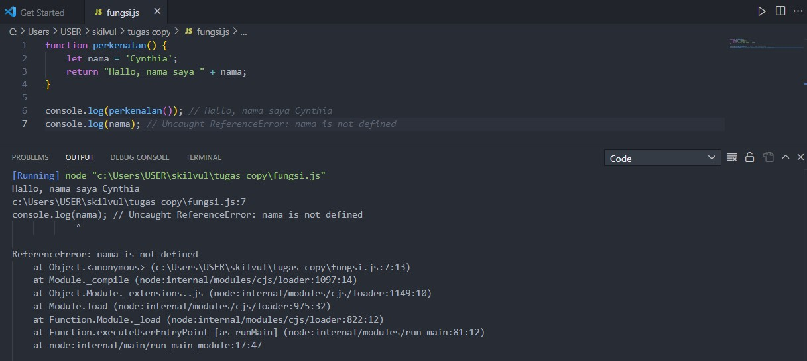
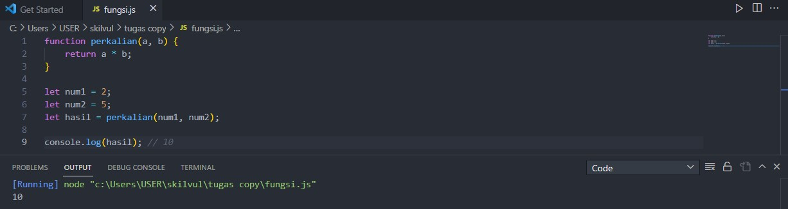
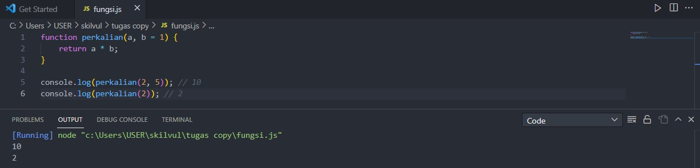
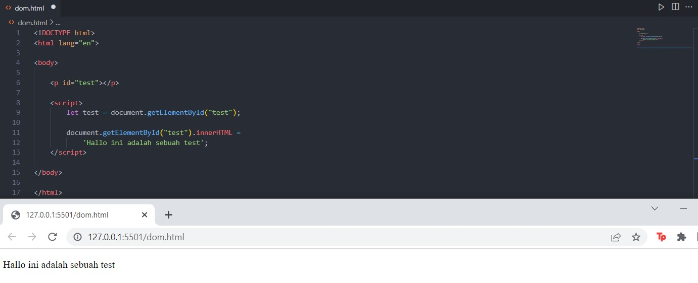
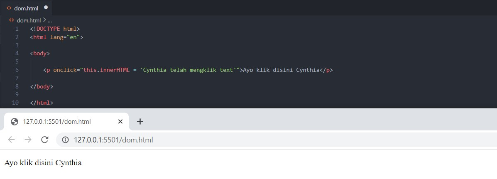
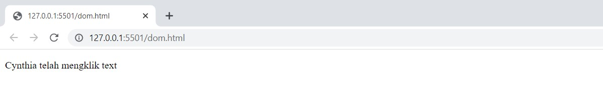
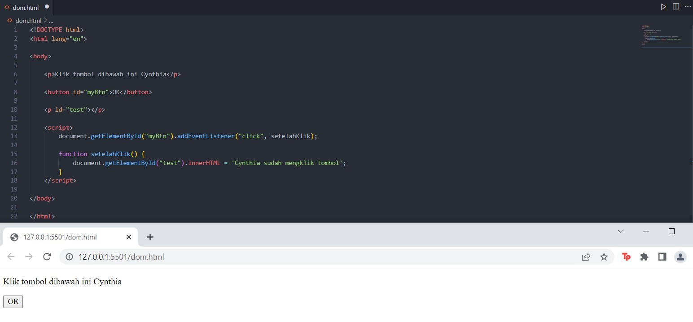
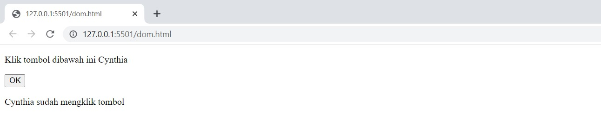

# Writing and Presentation Test Week 2
## **JavaScript Dasar**
### **Scope**
- Scope adalah konsep JavaScript yang membatasi pengaksesan variabel dan menentukan variabel mana yang dapat diakses
- Ada 2 tipe scope yaitu *local scope* dan *global scope*
- Jika sebuah variabel dideklarasikan dalam *global scope* artinya variabel tersebut dapat diakses darimanapun dalam kode yang dibuat
- *Local scope* variabel adalah variabel yang hanya dapat diakses di kode dalam scope(cakupan) tersebut
- Variabel *global scope* dideklarasikan di luar blocks, sebaliknya *local scope* dideklarasikan di dalam *blocks* sehingga yang dapat mengakses hanya kode di blok tersebut
- *Blocks* adalah kode yang berada di dalam kurung kurawal

Contoh *global scope* :

```
    let nama = 'Cynthia';

    function perkenalan(){
        return "Hallo, nama saya " + nama;
    }
    
    console.log(perkenalan()); // "Hallo, nama saya Cynthia"
    console.log(nama); // "Cynthia"
```



Contoh *local scope* :

```
    function perkenalan(){
        let nama = 'Cynthia';
        return "Hallo, nama saya " + nama;
    }
    
    console.log(perkenalan()); // "Hallo, nama saya Cynthia"
    console.log(nama); // Uncaught ReferenceError: nama is not defined
```



 > Note: Dapat dilihat dalam contoh kedua variabel nama dideklarasikan di dalam function, oleh karena itu variabel nama hanya dapat diakses di dalam function perkenalan()

### **Function**

- Function merupakan blok kode yang digunakan untuk mengerjakan fitur/tugas tertentu, jika fitur tersebut dibutuhkan kembali maka function bisa dipanggil lagi

Bentuk umum function adalah seperti ini :

```
    function namaFunction(){
        //kode yang dieksekusi
    }
```

> Note: Selain bentuk umum diatas, ada beberapa cara lain membuat function seperti dengan menggunakan ekspresi dan dengan tanda panah
>```
>    let namaFunction = function(){
>        //kode yang dieksekusi
>    }
>```
>```
>    namaFunction = () => {
>        //kode yang dieksekusi
>    }
>```

Untuk memanggil sebuah function dapat dilakukan :

```
    namaFunction();
```

#### **Parameter dan Argumen**

- Parameter digunakan untuk menerima nilai yang akan diproses dalam function
- Argumen adalah nilai yang diproses/digunakan dalam function
- Bagaimana mengetahui parameter apa yang dibutuhkan sebuah function dapat dilihat dari data yang dinamis dalam function tersebut

Contoh :

```
    function perkalian(a, b){
        return a * b;
    }

    let num1 = 2;
    let num2 = 5;
    let hasil = perkalian(num1, num2);

    console.log(hasil); // 10
```



> Note: Pada contoh diatas variabel a dan b merupakan parameter, lalu num1 dan num2 yang menyimpan nilai adalah argumennya

Ada juga penggunaan parameter default untuk memberikan nilai awal agar function tidak mengalami error ketika dipanggil tanpa argumen

Contoh :

```
    function perkalian(a, b=1){
        return a * b;
    }

    console.log(perkalian(2, 5)); // 10
    console.log(perkalian(2)); // 2
```



### **Data Type Built in Prototype & Method**

Pada minggu lalu sudah disebutkan dan dijelaskan beberapa macam tipe data pada JavaScript

Untuk menentukan jenis tipe data sebuah variabel dapat menggunakan :

```
    typeof
```

#### **Primitif dan Non-primitif**

- Primitif
  - Tipe data primitif hanya dapat menyimpan satu nilai pada satu waktu
  - Tidak memiliki metode tambahan
  - Dianggap sama jika nilai sama
  - Yang termasuk ke dalam primitif adalah : String, number, bigInt, boolean, undefined, null, dan simbol
- Non-primitif
  - Tipe data non-primitif dapat menyimpan lebih dari satu nilai pada satu waktu
  - Non-primitif tetap dianggap berbeda meskipun nilai dan urutannya sama
  - Yang termasuk ke dalam non-primitif : object dan array

#### **Built in Prototype & Method**

> Note: Akan disebutkan dan diberi contoh beberapa prototype atau method yang dapat digunakan pada tipe data string dan number

**String**
- **charAt** digunakan untuk mengembalikan sebuah karakter pada index yang diminta

```
   let nama = 'Cynthia';

   console.log(nama.charAt(0)); // "C"
   console.log(nama.charAt(1)); // "y"
```
  - **at** seperti charAt digunakan untuk mengembalikan sebuah karakter pada index yang diminta, namun bedanya at dapat memasukkan index negatif untuk mengambil karakter dari belakang

```
   let nama = 'Cynthia';

   console.log(nama.at(0)); // "C"
   console.log(nama.at(1)); // "y"
   console.log(nama.at(-1)); // "a"
```
  - **toUpperCase** digunakan untuk mengubah seluruh karakter dalam string menjadi kapital
```
   let nama = 'Cynthia';

   console.log(nama.toUpperCase()); // "CYNTHIA"
```
  - **length** digunakan untuk mengembalikan banyaknya karakter dalam string
```
   let nama = 'Cynthia';

   console.log(nama.length()); // 7
```
  - **concat** digunakan untuk menggabungkan dua atau lebih string
```
   let nama = 'Cynthia';
   let nama2 = 'Paramitha';

   console.log(nama.concat(' ', nama2)); // "Cynthia Paramitha"
   console.log(nama.concat('...', nama2)); // "Cynthia...Paramitha"
```

**Number**
- **isNaN** digunakan untuk melihat apakah nilai merupakan bukan number, sebelum dilakukan testing isNaN akan mengkonversi sebuah nilai menjadi number terlebih dahulu

```
    let num1 = 10;
    let num2 = "10";
    let num3 = "sepuluh";

    console.log(isNaN(num1)); // false
    console.log(isNaN(num2)); // false
    console.log(isNaN(num3)); // true
```
- **isInteger** digunakan untuk menentukan apakah sebuah number merupakan integer atau bukan

```
    let num1 = 10;
    let num2 = "10";

    console.log(Number.isInteger(num1)); // true
    console.log(Number.isInteger(num2)); // false
```
- **toString** digunakan untuk mengubah number menjadi string

```
    let num = 2022;
    let tahun = num.toString();

    console.log(tahun); // "2022"
```
#### **Math**
Math adalah sebuah objek *built in* yang digunakan untuk mempermudah dalam melakukan perhitungan matematika di dalam JavaScript

Berikut adalah beberapa fungsi dalam Math :

- **Math.PI** adalah fungsi Math yang bernilai phi atau sekiranya 3.14159

```
    function luasLingkaran(r) {
        hasil = Math.PI * r * r;
        return hasil;
    }

    console.log(luasLingkaran(10)); // 314.1592653589793
    console.log(luasLingkaran(2)); // 12.566370614359172
```
- **Math.sqrt** digunakan untuk menghitung akar

```
    function hitungAkar(a) {
        hasil = Math.sqrt(a);
        return hasil;
    }

    console.log(hitungAkar(9)); // 3
```
- **Math.abs** digunakan untuk mengembalikan nilai absolut dari number

```
    console.log(Math.abs(9)); // 9
    console.log(Math.abs(-9)); // 9
    console.log(Math.abs("9")); // 9
    console.log(Math.abs("sembilan")); // NaN
    console.log(Math.abs(18-9)); // 9
```
- **Math.round** digunakan untuk membulatkan nilai ke yang terdekat, jika dibalik koma >= 5 maka nilai akan dibulatkan ke atas, sebaliknya jiak < 5 maka dibulatkan ke bawah

```
    console.log(Math.round(9.50)); // 10
    console.log(Math.round(9.30)); // 9
    console.log(Math.round(9.17)); // 9
    console.log(Math.round(9.71)); // 10
```
- **Math.max** digunakan untuk mengembalikan nilai terbesar

```
    let a = Math.max(10, 100, 50, 200, 300);

    console.log(a); // 300
```

### **DOM**
- DOM (*Document Object Model*) bukan bagian dari JavaScript tapi bagian dari *web browser*
- Merupakan sebuah interface yang memungkinkan untuk melakukan manipulasi halaman HTML melalui element-nya

Mengambil element HTML menggunakan DOM dapat dilakukan dengan beberapa cara :

> - **Mengambil Element dengan ID**
> ```
>   document.getElementById()
> ```
> - **Mengambil Element dengan Class**
> ```
>   document.getElementsByClassName()
> ```
> - **Mengambil Element dengan Nama Tag**
> ```
>   document.getElementsByTagName()
> ```
> - **Mengambil Element dengan querySelector**
> ```
>   document.querySelector()
> ```
> - **Mengambil Element dengan querySelectorAll**
> ```
>   document.querySelectorAll()
> ```
> > Note: querySelector & querySelectorAll dapat digunakan untuk mengambil element CSS

#### **Mengubah Element**
- **Element.textContent** digunakan untuk mengubah teks di dalam sebuah element
- **Element.innerHTML** digunakan untuk mengubah konten HTML di dalam sebuah element

Contoh penggunaan :
```
<!DOCTYPE html>
<html>
<body>

<p id="test"></p>

<script>
let test = document.getElementById("test");

document.getElementById("test").innerHTML = 
'Hallo ini adalah sebuah test';
</script>

</body>
</html>
```



#### **Menambah dan Menghapus Element**

Selain mengubah konten sebuah element, dalam DOM juga dapat menambahkan serta menghapus element

> - **createElement** digunakan untuk menambahkan element baru
> ```
>   document.createElement()
> ```
> > Note: Setelah membuat element, gunakan textContent untuk mengubah konten element-nya serta appendChild untuk ditambakan ke DOM
> - **removeChild** digunakan untuk menghapus element
> ```
>   Element.removeChild()
> ```

#### **Event**
Event adalah interaksi yang terjadi antara pengguna dan sebuah element

Ada beberapa cara untuk menggunakan event, diantaranya :

- **Attribute Event** dilakukan dengan memasukkan event atribut ke element HTML




- **Event Listener** dengan menggunakan event listener, halaman web akan merespon terhadap event yang dilakukan


