# Writing and Presentation Test Week 3
## **JavaScript Intermediate**
### **Array**
**Learning Objective:** Peserta mampu memahami dan menggunakan struktur data Array
- Dalam JavaScript Array merupakan jenis variabel yang dapat menampung lebih dari satu nilai dengan tipe data bisa berbeda
- Dibawah ini merupakan struktur umum dari Array :
```
    let nama_array = [item1, item2,...];
```
> Note: Deklarasi Array juga dapat menggunakan const dan var, selain let

- Indeks Array dimulai dari nol (0)
- Contoh penggunaan Array :
```
    let member = ["Wonjin", "Taeyoung", "Hyeongjun"];

    console.log(member); // [ 'Wonjin', 'Taeyoung', 'Hyeongjun' ]
    console.log(member[0]); // Wonjin
```
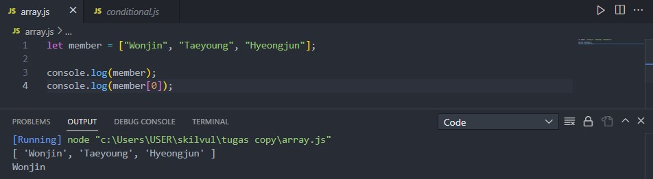
- Di dalam JavaScript terdapat beberapa built-in prototype yang dapat digunakan pada sebuah tipe data Array, contohnya : length, push, pop, unshift, shift, splice, dll.
- Contohnya penggunaan :
```
    let member = ["Wonjin", "Taeyoung", "Hyeongjun"];

    let many = member.length;
    console.log(many); // 3

    member.push("Minhee", "Jungmo");
    console.log(member); // [ 'Wonjin', 'Taeyoung', 'Hyeongjun', 'Minhee', 'Jungmo' ]

    member.pop();
    console.log(member); // [ 'Wonjin', 'Taeyoung', 'Hyeongjun', 'Minhee' ]

    member.unshift("Woobin");
    console.log(member); // [ 'Woobin', 'Wonjin', 'Taeyoung', 'Hyeongjun', 'Minhee' ]

    member.shift();
    console.log(member); // [ 'Wonjin', 'Taeyoung', 'Hyeongjun', 'Minhee' ]

    member.splice(3,1);
    console.log(member); // [ 'Wonjin', 'Taeyoung', 'Hyeongjun' ]
```
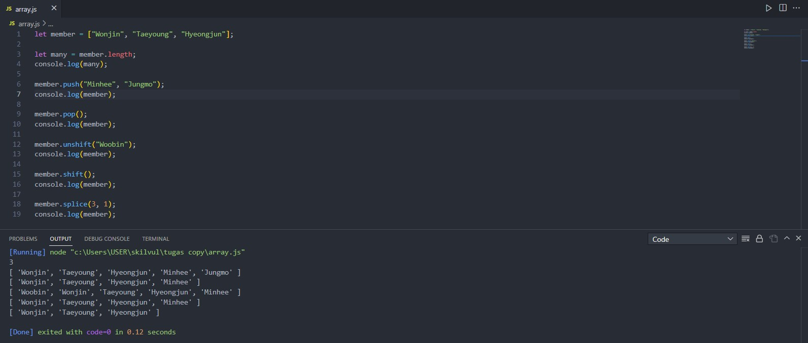
- Melakukan looping dengan Array dapat menggunakan beberapa cara tetapi 2 yang wajib diketahui adalah foreach dan map
- Dengan menggunakan map kita dapat mengembalikan nilai tidak seperti foreach
- Contoh penggunaan :
```
    let member = ["Wonjin", "Taeyoung", "Hyeongjun"];

    member.forEach((person) => {
        console.log(person); // Wonjin Taeyoung Hyeongjun
    })

    let bias = member.map((person) => {
        return person + " adalah biasku";
    })

    console.log(bias); // [ 'Wonjin adalah biasku', 'Taeyoung adalah biasku', 'Hyeongjun adalah biasku' ]
```
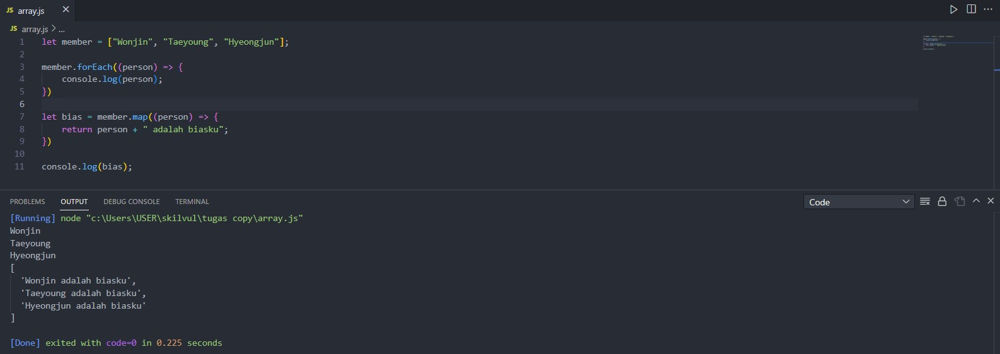

- Array multidimensi memiliki konsep yang sama dengan Array biasa, bedanya sebuah nilai tidak hanya memiliki satu indeks, melainkan sebanyak dimensinya

### **Object**
**Learning Objectives:**\
Peserta mampu memahami dan menggunakan struktur data Object\
Peserta mampu memahami dan menggunakan struktur data Array of Objects
- Object merupakan sebuah wadah untuk nilai yang diberi nama (properti)
- Dibawah ini merupakan struktur umum dari Object :
```
    let nama_obj = {
        properti1: "value1",
        properti2: "value2",
        ...
    }
```
> Note: Deklarasi Object juga dapat menggunakan const dan var, selain let
- Mengakses sebuah Object dapat menggunakan *dot* atau *bracket*, seperti di bawah ini :
```
    let profil = {
        nama: "Cynthia",
        umur: 21,
        "asal kampus": "Universitas Gunadarma"
    }

    console.log(profil.nama); // Cynthia
    console.log(profil["asal kampus"]); // Universitas Gunadarma
```
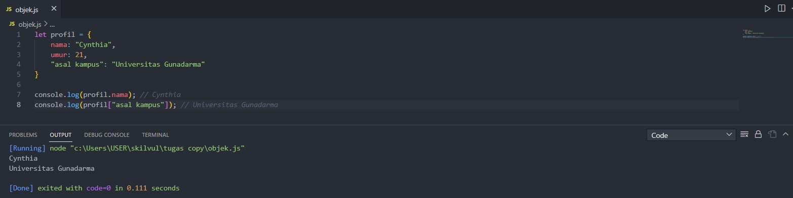

- Kelebihan yang dimiliki *bracket* adalah ia dapat memanggil properti yang memiliki spasi dalam penulisan nama, sementara *dot* tidak bisa
- Untuk membuat properti dalam sebuah Object juga dapat menggunakan *dot* dan *bracket*
- Contoh penggunaan :
```
    let profil = {
        nama: "Cynthia",
        umur: 21,
        "asal kampus": "Universitas Gunadarma"
    }

    console.log(profil); // { nama: 'Cynthia', umur: 21, 'asal kampus': 'Universitas Gunadarma' }

    profil.hobi = "Mendengarkan Musik";
    profil["nomor hp"] = "081288746848";
    console.log(profil); // { nama: 'Cynthia', umur: 21, 'asal kampus': 'Universitas Gunadarma', hobi: 'Mendengarkan Musik', nomor hp': '081288746848' }
```
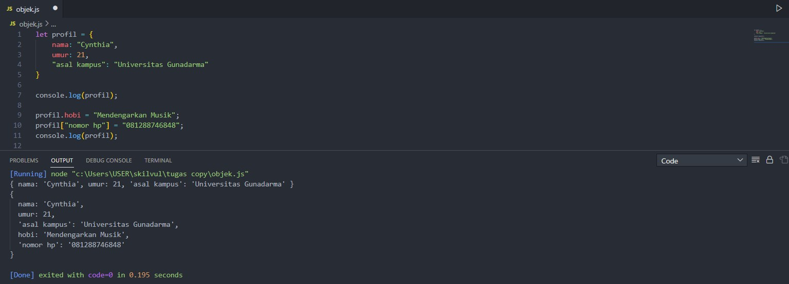
- Jika data tersebut berupa Object meskipun dideklarasikan dengan const, isinya dapat diubah (sama hal-nya dengan Array)
- Properti dalam Object dapat dihapus menggunakan *dot* maupun *bracket*
- Object dapat diisi dengan method (merupakan istilah dari properti yang bernilai function), method ini adalah tindakan yang dapat dilakukan Object
- Contoh penggunaan :
```
    let sapa = {
        pagi: function() {
            return "Selamat pagi!";
        },
        malam: function() {
            return "Selamat malam!";
        }
    }

    console.log(sapa.pagi()); // Selamat pagi!
    console.log(sapa.malam()); // Selamat malam!
```
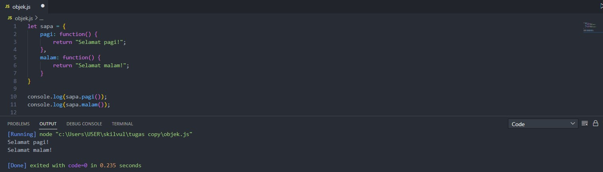

- Untuk looping Object, digunakan for in, seperti :
```
    let profil = {
        nama: "Cynthia",
        umur: 21,
        "asal kampus": "Universitas Gunadarma"
    }

    for (let key in profil) {
        console.log(profil[key]); // Cynthia 21 Universitas Gunadarma
    }
```
- Looping for in memiliki konsep mengakses Object seperti menggunakan *bracket* dimana key adalah sebagai properti-properti dalam Object

#### **Array of Objects**
- Merupakan sebuah gabungan dari Array dan Object dimana nilai dari Array adalah Object
- Untuk berinteraksi dengan Array of Objects, digunakan konsep yang sama seperti dalam Array
- Contoh looping Array of Objects :
```
    let profil = [
    {
        nama: "Cynthia",
        umur: 21,
        "asal kampus": "Universitas Gunadarma"
    },
    {
        nama: "Dodi",
        umur: 22,
        "asal kampus": "Kampus X"
    },
    {
        nama: "Eka",
        umur: 20,
        "asal kampus": "Kampus Y"
    }];

    let data = profil.map((person) => {
        console.log("Umur " + person.nama + " adalah " + person.umur + " tahun"); // Output di gambar
    });
```
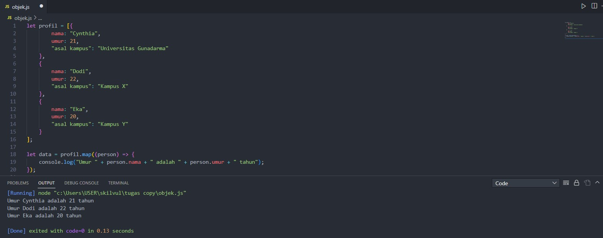

### **Recursive**
**Learning Objective:** Peserta mampu memahami dan membuat program Rekursif
- Recursive adalah function yang memanggil dirinya sendiri hingga kondisi tertentu
- Biasa digunakan dalam perhitungan matematika yang kompleks seperti faktorial, cara kerja Recursive seperti looping
- Bentuk umum dari Recursive adalah :
```
    function namaFunction(){
        // base case
        // titik paling kecil(berhenti)

        // recursion case
        // titik dia memanggil diri sendiri hingga bertemu base case
    }
```
- Contoh pengaplikasian Recursive untuk menampilkan deret aritmatika sesuai suku yang diminta dengan suku pertama 1 dan beda 2
```
    // Output yang diharapkan
    // 1 3 5 7 9

    function deretAritmatika(n) {
        if (n == 1) {
            console.log(1);
        } else {
            deretAritmatika(n - 1)
            console.log(1 + (n - 1) * 2);
        }
    }

    deretAritmatika(5); // 1 3 5 7 9
```
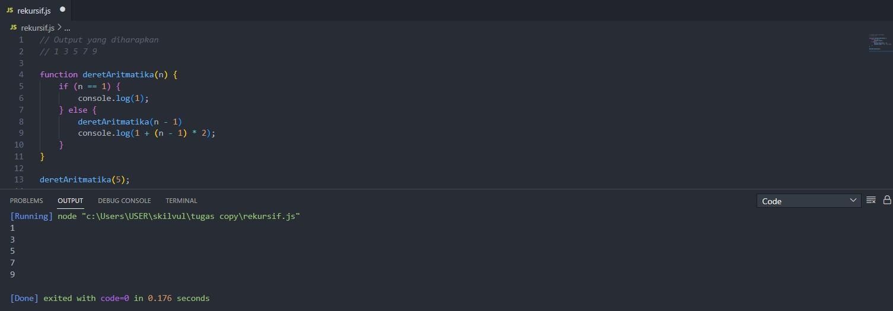

### **Asynchronous**
**Learning Objective:** Peserta mampu memahami proses Asynchronous pada JavaScript
- JavaScript secara default adalah Synchronous dalam artian ia akan menjalankan kode secara berurutan
- Sementara dalam Asynchronous dapat terjadi konsep selak-menyelak jika sebuah perintah mengambil waktu yang cukup lama ketika dijalankan
- Dalam JavaScript untuk melakukan proses Asynchronous dapat menggunakan setTimeout atau setInterval untuk simulasi
- Berikut adalah penjalanan kode JavaScript secara normal :
```
    function cetakA(){
        console.log("A");
    }

    function cetakB(){
        console.log("B");
    }

    function cetakC(){
        console.log("C");
    }

    cetakA();
    cetakB();
    cetakC();

    //Output
    // A
    // B
    // C
```
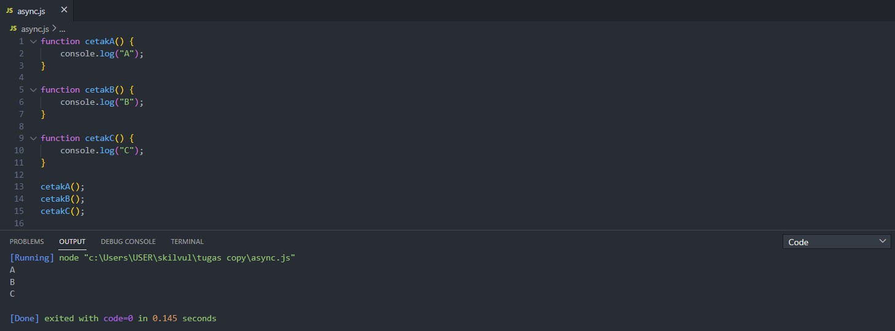

- Disimulasikan proses Asynchronous menggunakan setTimout dalam kode diatas :
```
    function cetakA(){
        console.log("A");
    }

    function cetakB(){
        setTimeout(function () {
            console.log("B");
        }, 100);
    }

    function cetakC(){
        console.log("C");
    }

    cetakA();
    cetakB();
    cetakC();

    //Output
    // A
    // C
    // B
```
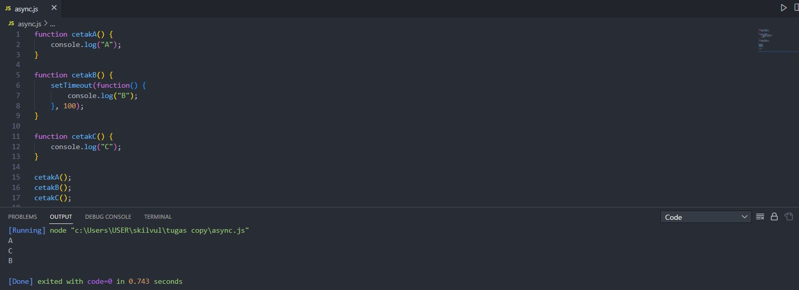

- Dalam proses Asynchronous terdapat 3 kunci utama yaitu : callback, promise, dan async-await
- Di bawah adalah contoh penggunaan callback dapat digunakan untuk memperbaiki proses Asynchronous menjadi berurutan lagi, dengan memanggil function cetakC dalam parameter function cetakB agar cetakB dijalankan terlebih dahulu
```
    function cetakA(){
        console.log("A");
    }

    function cetakB(callback){
        setTimeout(function () {
            console.log("B");
            callback();
        }, 100);
    }

    function cetakC(){
        console.log("C");
    }

    cetakA();
    cetakB(cetakC);

    //Output
    // A
    // B
    // C
```
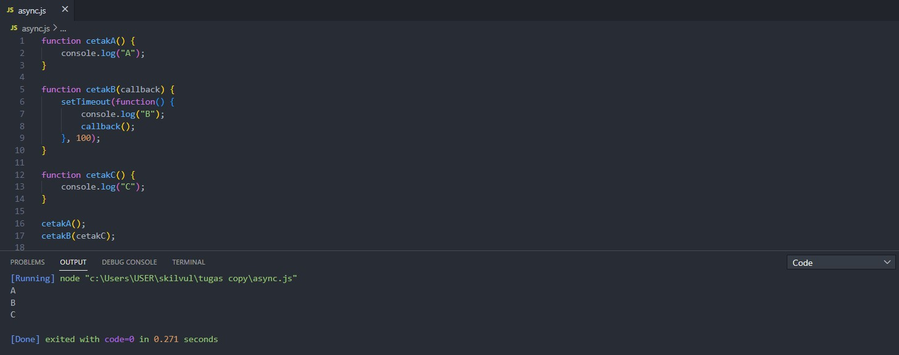

> Note: Namun jika callback terus menerus digunakan kode akan sulit dibaca dan akan terjadi kasus *callback hell*, selain menggunakan callback dapat juga menggunakan promise

### **Web Storage**
**Learning Objective:** Peserta mampu memahami dan memanipulasi data menggunakan Web Storage
- JavaScript bisa mengakses hal-hal seperti DOM dan setTimeout karena ada perantara web API
- Web storage dalam browser adalah sebagai tempat untuk menyimpan data
- Ada beberapa cara untuk menyimpan data seperti pencarian, artikel berita, dll. menggunakan web storage
- Macam-macam web storage ada seperti cookies, local storage, dan session storage
- Session storage dapat dimanipulasi menggunakan JavaScript, seperti :
> Mendeklarasikan/mendefinisikan suatu nilai 
```
    sessionStorage.setItem('variabel', 'value');
```
> Mengambil data
```
    sessionStorage.getItem('variabel');
```
> Menghapus data
```
    sessionStorage.removeItem('variabel');
```
> Menghapus semua Session Storage
```
    sessionStorage.clear();
```