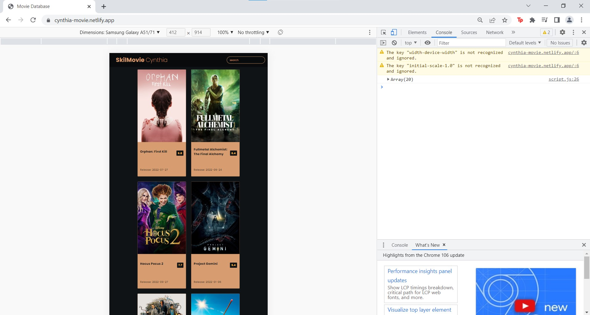
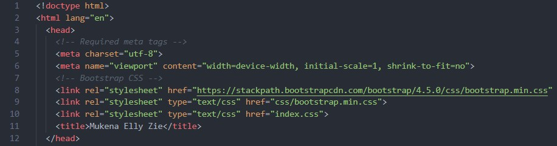

# Writing and Presentation Test Week 4
## **Responsive Web**
**Learning Objective:**\
Peserta mampu memahami apa itu Responsive Web Design\
Peserta mampu menggunakan tools untuk membuat website yang responsif\
Peserta mampu memahami dan menggunakan viewport\
Peserta mampu memahami dan menerapkan Relative CSS Unit\
Peserta mampu memahami dan menggunakan Media Query\
Peserta mampu memahami dan menggunakan Flexbox dan Grid

- Responsive Web Design atau RWD bertujuan untuk memungkinkan web yang dibuat dapat diakses dalam perangkat manapun
- Perangkat yang digunakan oleh pengguna berbeda-beda, bisa itu PC, tab, atau mobile
- Web harus dapat menyesuaikan tampilan dengan perangkat, agar masih fungsional dan tidak berantakan

### **Chrome Dev Tools**
- Adalah sebuah tools yang dapat mempermudah developer dalam proses pembuatan website
- Untuk mengakses Chrome Dev Tools pada Windows dapat menggunakan shortcut di bawah ini dalam browser Google Chrome:
```
    Ctrl + Shift + J
```




### **Viewport**
- Merupakan istilah dari area yang terlihat dalam tampilan web
- Dengan menggunakan tag meta viewport, viewport dapat diatur sesuai kebutuhan
```
<meta name="viewport" content="width=device-width, initial-scale=1">
```
> - **Width** untuk mengatur lebar halaman diberikan nilai **device-width** maka lebar halaman akan mengikuti ukuran lebar dari perangkat
> - **Initial-scale** untuk mengatur skala dari halaman web

Contoh penggunaan viewport :


### **Relative CSS Units**
Merupakan CSS unit yang responsif ketika digunakan dalam mendesain web karena ukurannya bisa berubah relatif terhadap parent atau ukuran layar

Ada beberapa Relative CSS Units, diantaranya :
- **em** relatif terhadap ukuran font dari elemen
- **ex** relatif terhadap tinggi dari karakter "x" kecil font yang sedang aktif
- **ch** ukurannya mengikuti jumlah karakter
- **rem** relatif terhadap ukuran font elemen root
- **vw** relatif terhadap 1% lebar dari viewport
- **vh** relatif terhadap 1% tinggi dari viewport
- **vmin** relatif terhadap ukuran viewport yang lebih kecil
- **vmax** relatif terhadap ukuran viewport yang lebih besar	
- **%** relatif terhadap parent elemen

Contoh penggunaan unit CSS relatif :


> Note: Padding berukuran 1rem, artinya padding dari elemen dengan class overview mempunyai ukuran sama dengan ukuran font dari elemen root-nya overview

### **Media Query**
- Digunakan untuk menggunakan/membuat style berbeda berdasarkan ukuran perangkat tertentu yang sudah diatur
- Umumnya hanya menggunakan 2 jenis media query, yaitu min-width dan max-width

Contoh penggunaan media query :


> Note: Perangkat yang layarnya tidak melewati 450px akan memiliki ukuran font 20px pada elemen a dengan class overlay, dll.

### **Flexbox dan Grid**
Flexbox dan grid pada CSS sama-sama digunakan untuk mengatur layouting tampilan halaman agar lebih teratur, bedanya flexbox hanya mengatur tampilan secara horizontal atau vertikal saja (salah satu), sementara grid dapat mengatur layouting secara horizontal dan vertikal

- Untuk menggunakan flexbox dapat mendefinisikan display flex pada elemen :
```
    display: flex;
```
> Note: Mengatur arah dari elemen dapat menggunakan flex-direction bernilai row atau column

- Untuk membuat layout menggunakan CSS Grid cukup menambahkan display grid di elemen :
```
    display: grid;
```
>Note: Properti grid digunakan untuk mengatur ukuran elemen & properti grid-gap untuk mengatur jarak antar elemen)

Contoh penggunaan flexbox :


> Note: elemen header terdefinisi sebagai flex dan properti align-items center digunakan untuk memposisikan item-item di dalam elemen ke tengah, lalu justify-content space-between untuk memberikan jarak diantara isi dari elemen

## **Bootstrap**
**Learning Objective:**\
Peserta mampu memahami mengapa dan kapan menggunakan Bootstrap\
Peserta mampu memahami dan menggunakan layout pada Bootstrap\
Peserta mampu memahami dan menggunakan content pada Bootstrap\
Peserta mampu memahami dan mengunakan component pada Bootstrap

- Bootstrap adalah framework HTML, CSS, dan JavaScript yang berfungsi untuk membantu mendesain web
- Dengan menggunakan Bootstrap tidak perlu meng-coding komponen-komponen website dari nol
- Bootstrap tersusun dari kumpulan file CSS dan JavaScript berbentuk class yang bisa langsung dipakai ketika dipanggil
- Bootstrap bersifat responsif, sistem grid pada bootstrap menggunakan rangkaian containers, baris, dan kolom untuk menyesuaikan bentuk layout serta konten website
- Newbie friendly karena mudah digunakan dan bersifat open-source, namun oleh karena itu elemen-elemen Bootstrap sudah banyak digunakan oleh developer lainnya

Untuk menggunakan Bootstrap dapat dilakukan dengan menyisipkan tag link ke html dengan seperti ini :



### **Layout**
- Sistem grid yang digunakan Bootstrap untuk mengatur tata letak (layout) terdiri dari 12 kolom dan 6 breakpoint
- Satu kolom penuh panjangnya adalah 12, jika dibagi dua maka panjangnya 6
- Kolom pada grid hanya bisa dibagi sampai 12
- Untuk menentukan tampilan responsif terhadap ukuran viewport perangkat tertentu dapat menggunakan breakpoint
- Container adalah fondasi dasar dari blok layout yang memiliki fungsi untuk membungkus blok di dalamnya
- Class row dan col digunakan untuk membuat grid (baris dan kolom)

Contoh penggunaan layout Bootstrap :


> Note: Pada gambar di atas merupakan pembuatan footer menggunakan Bootstrap

### **Content**
- Dalam Bootstrap terdapat beberapa pengaturan konten yang tersedia untuk digunakan, seperti untuk gambar, tabel, dll
- Berikut adalah contoh penggunaan konten Bootstrap untuk tabel :


> Note: Pada gambar di atas merupakan pembuatan sebuah header tabel dengan menggunakan Bootstrap

### **Component**
- Bootstrap juga menyediakan komponen-komponen yang siap dipakai seperti tampilan button, card, dll


> Note: Pada gambar di atas merupakan pembuatan image card yang memiliki button di dalamnya dengan menggunakan komponen Bootstrap

Pada Gambar di bawah adalah halaman indeks website yang saya buat menggunakan Bootstrap untuk projek penulisan di kuliah pada semester lalu


