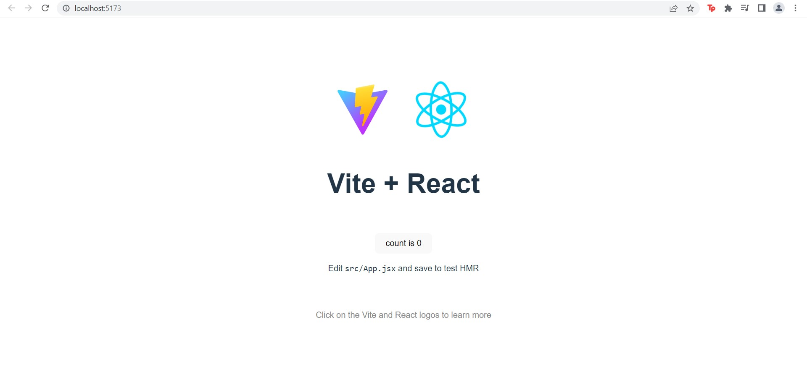

# Writing and Presentation Test Week 5
## **React.js**
**Learning Objective:**\
Peserta mampu memahami React.js secara fundamental\
Peserta mampu menjalankan aplikasi React.js\
Peserta mampu memahami dan membuat component pada React.js\
Peserta mampu memahami dan menggunakan JSX\
Peserta mampu membedakan class component dan functional component\
Peserta mampu memahami state dan props\
Peserta mampu memahami lifecycle method pada React.js\

- React.js merupakan sebuah framework view library JavaScript yang dibuat oleh Tim Engineer Facebook pada tahun 2011 untuk membuat tampilan (UI) pada website
- Keunggulan React.js mencakup: kerjanya yang membuat aplikasi menjadi lebih cepat meski data yang di-handle berbagai macam, React.js membagi sebuah tampilan menjadi komponen-komponen kecil, dan proses penulisan komponen tersebut difasilitasi sehingga lebih mudah untuk dibuat, Komponen-nya juga dapat dimanfaatkan ulang, React.js sudah banyak digunakan oleh perusahaan startup, dll.
- Untuk menjalankan React.js dengan npx create-react-app dapat dilakukan langkah-langkah berikut ini:
> 1. Install Node.js
> 2. Jalankan npx create-react-app di terminal folder projek
> 
> 3. Tunggu prosesnya
> 
> 4. Masuk ke project dengan command cd
> 
> 5. jalankan npm start
> 
> 
> 6. Lalu untuk memulai kodingan dengan react untuk ditampilkan, lakukan di dalam src
> 

- Selain dengan yang diatas, dapat digunakan vite juga:
> 1. Buat folder project dan buka terminal-nya untuk menjalankan kode-kode berikut
> ```
>    npm create vite@latest react-component --template react
>    cd react-component
>    npm install
>```
> 
> 2. Jalankan dengan npm run dev
> 
> 

### **JSX**
- JSX adalah adalah ekstensi dari React (untuk JavaScript)
- Penulisan pada sintaks JSX hampir mirip dengan HTML, sehingga developer dapat menyusun elemen pada komponen React dengan lebih mudah


> Note: Pada gambar diatas, yang merupakan file React adalah App.jsx karena memiliki ekstensi JSX

### **Component**

- Pada React.js, component memungkinkan developer untuk membagi tampilan menjadi bagian-bagian yang independen yang dapat digunakan kembali
- Cara untuk membuat component ada dua yaitu dengan function atau class
- Berikut merupakan contoh pembuatan component dengan function untuk tombol yang menambahkan angka jika di klik

```
import React, { useState } from "react";
 
const FunctionalComponent=()=>{
    const [count, setCount] = useState(0);
 
    const increase = () => {
        setCount(count+1);
    }
 
    return (
        <div style={{margin:'50px'}}>
            <h1>Halo ini adalah sebuah test</h1>
            <h3>Klik tombol untuk menambah angka: </h3>
          <h2>{count}</h2>
            <button onClick={increase}>Tombol</button>
        </div>
    )
} 

export default FunctionalComponent;
```


Hasil:


### **Function Component vs Class Component**

- Function Component:
    - Merupakan jenis React component yang sintaks-nya dapat  dikatakan lebih mudah
    - Memungkinkan developer untuk menggunakan React Hooks yang pada dasarnya disediakan oleh React agar dapat menggunakan state dengan useState()
    - Tidak dapat menggunakan method Lifecycle
    - Dalam function tidak ada method render
- Class Component:
    - Harus memiliki method render
    - Jika function component adalah stateless yang butuh React Hooks untuk menggunakan state, maka class component adalah stateful
    - method React Lifecycle dapat digunakan dalam class component

### **State dan Props**

- State:
    - Adalah sebuah objek yang digunakan untuk menangani data yang sifatnya berubah-ubah
    - Dalam kata lain component akan di-render ulang ketika objek tersebut berubah
    - State hanya bisa diakses di dalam component dimana state itu dibuat
- Props:
    - Merupakan argumen atau cara untuk meneruskan dan mengakses data dari component lain
    - Props dapat diakses dari component lain

### **Method Lifecycle**
Lifecycle merupakan siklus yang dilakukan oleh React ketika aplikasi dijalankan. Component di dalam React akan melewati tiga fase, yaitu: Mounting, Updating, dan Unmounting

1. Fase Mounting adalah fase ketika component pertama kali dibuat atau dirender ke DOM
   - componentWillMount/constructor adalah method yang akan di eksekusi pertama
   - Dalam method render adalah proses penyimpanan file jsx yang akan di render ke DOM
   - componentDidMount lalu dilakukan setelah render
2. Fase updating adalah fase yang terjadi saat sebuah component akan di render ulang, updating terjadi ketika ada perubahan pada state atau props yang mengakibatkan perubahan kepada DOM, componentDidUpdate terjadi apabila render berhasil
3. Fase unmounting adalah fase yang terjadi ketika component dihapus dari DOM, componentWillUnmount terjadi sebelum component dihapus