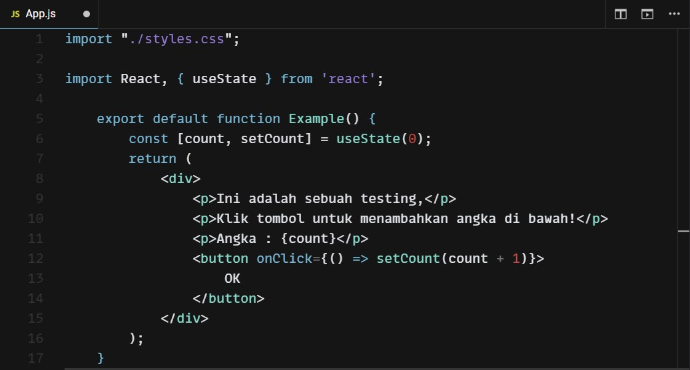
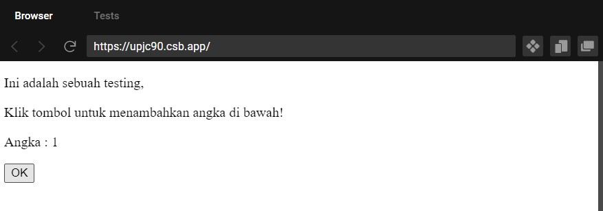
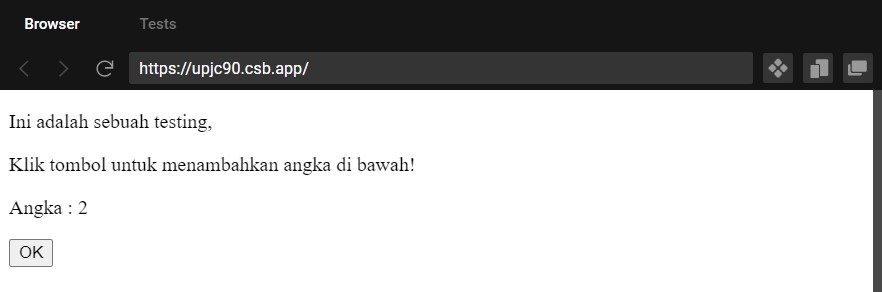
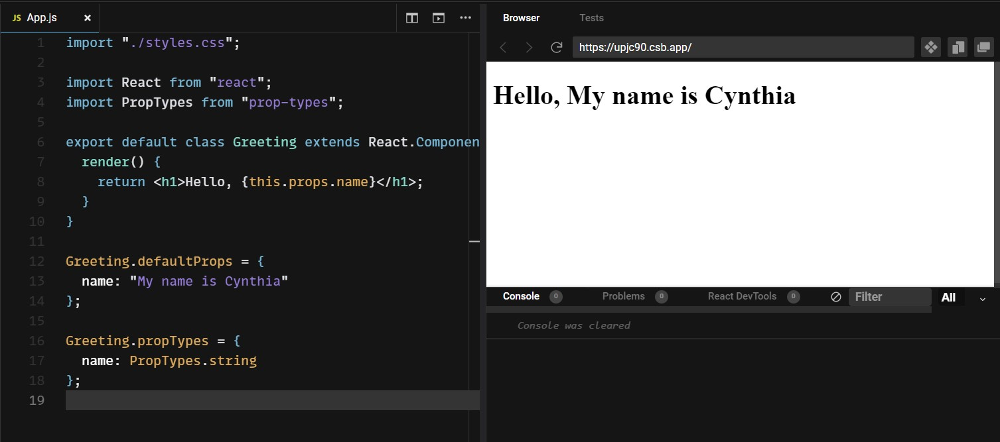
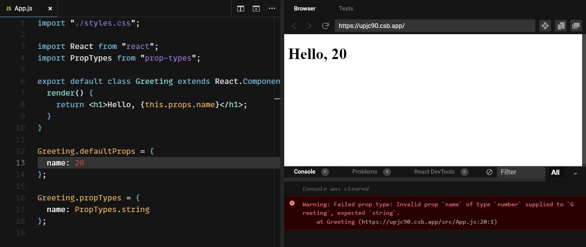
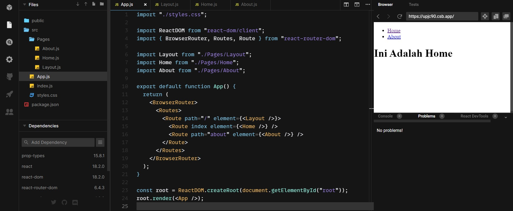
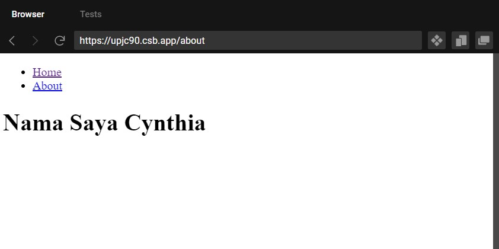
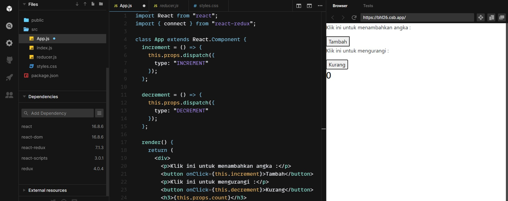
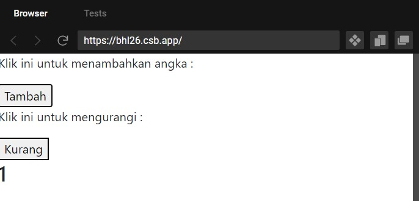

# Writing and Presentation Test Week 6
## **React Lanjutan**
**Learning Objective:**\
Peserta mampu memahami dan menggunakan React Hooks\
Peserta mampu memahami dan menggunakan PropTypes

### **React Hooks**
- Merupakan sebuah fitur yang memungkinkan untuk menggunakan state tanpa menuliskan class (dengan function)
- Selain untuk menggunakan state, React Hooks juga bertujuan untuk mempermudah dalam penggunaan fitur lain seperti lifecycle method
- Dengan React Hooks, function yang sebelumnya dipanggil *stateless components* berubah menjadi *function components* karena adanya fitur yang memperbolehkan kemampuan adanya state di dalam function

Beberapa Hooks yang sering digunakan ada :

1. **useState()** yang digunakan untuk membuat dan mengupdate state
2. **useEffect()** yang juga bisa menjadi alternatif untuk lifecycle method componentDidMount() dan componentDidUpdate(), useEffect() dieksekusi setelah render
3. **useContext()** yang digunakan untuk mempermudah pemakaian context

Dalam class untuk inisialisasi state menggunakan this, sementara pada function tidak ada this oleh karena itu dapat digunakan useState untuk mendeklarasikan sebuah variabel state

Berikut adalah contoh penggunaan React Hooks untuk menggunakan state dalam sebuah function component :

```
    import React, { useState } from 'react';
    
    export default function Example() {
        const [count, setCount] = useState(0);
        return (
            <div>
                <p>Ini adalah sebuah testing,</p>
                <p>Klik tombol untuk menambahkan angka di bawah!</p>
                <p>Angka : {count}</p>
                <button onClick={() => setCount(count + 1)}>
                    OK
                </button>
            </div>
        );
    }
```



Tampilan dengan meng-klik sekali, state awal(0) + 1:



Klik lagi, state terbaru + 1:



### **PropTypes**
- Adalah sebuah library untuk menvalidasi Props, yang sudah dipelajari dari minggu lalu, Props adalah argumen atau cara untuk meneruskan dan mengakses data dari component lain
- Jika melanggar aturan yang sudah ditetapkan PropTypes, maka akan muncul error warning di konsol (tetapi kode masih berjalan)

Penggunaan PropTypes jika tidak melanggar aturan dan tipe benar :
```
    import React from "react";
    import PropTypes from "prop-types";

        export default class Greeting extends React.Component {
            render() {
                return <h1>Hello, {this.props.name}</h1>;
            }
        }

    Greeting.defaultProps = {
        name: "My name is Cynthia"
    };

    Greeting.propTypes = {
        name: PropTypes.string
    };
```


Yang terjadi jika melanggar aturan dan tipe Props salah :
```
    import React from "react";
    import PropTypes from "prop-types";

        export default class Greeting extends React.Component {
            render() {
                return <h1>Hello, {this.props.name}</h1>;
            }
        }

    Greeting.defaultProps = {
        name: 20
    };

    Greeting.propTypes = {
        name: PropTypes.string
    };
```


> Note: Terdapat error pada log konsol tapi masih berjalan

## **React Router**
**Learning Objective:**\
Peserta mampu memahami konsep routing pada React.js\
Peserta mampu membuat routing dasar\

- Routing adalah sebuah konsep pengarahan halaman berbeda berdasarkan tindakan yang dilakukan, jadi React Router digunakan untuk menentukan/membuat rute-rute dalam aplikasi
- React Router biasa digunakan untuk menampilkan banyak tampilan dalam satu halaman
- Untuk aplikasi web akan lebih fokus kepada react-router-dom, peng-installan react router dapat menggunakan :
```
    npm install react-router-dom
```

- Dalam router terdapat dua jenis komponen yaitu Browser Router untuk menangani URL dinamis dan Hash Router untuk statis
- List Route yang ingin digunakan harus dibungkus dengan Routes
- Berikut adalah pembuatan routing dasar :



Jika klik about/pindah halaman :



## **React Redux**
**Learning Objective:**\
Peserta mampu memahami konsep dan menggunakan Redux\
Peserta mampu memahami dan menggunakan React Redux\

-  Redux adalah tools untuk mengelola state aplikasi, digunakan untuk memudahkan dalam pengembangan aplikasi
-  Ada 3 konsep dasar dalam redux yaitu : Store, reducer, dan action

    - **Action** sederhananya merupakan sebuah object yang memiliki property type
    - **Reducer** adalah bagian yang merubah state menjadi respon yang terjadi ketika action di dispatch()
    - **Store** bertujuan untuk menggabungkan action dan reducer agar bisa bekerja sebagai pengelola state

> Note: dipatch() adalah method yang digunakan untuk trigger perubahan terhadap state dari store

Untuk install React Redux dapat menggunakan :
```
npm install react-redux
```
Berikut adalah penggunaan React Redux untuk aplikasi sederhana increment dan decrement :



